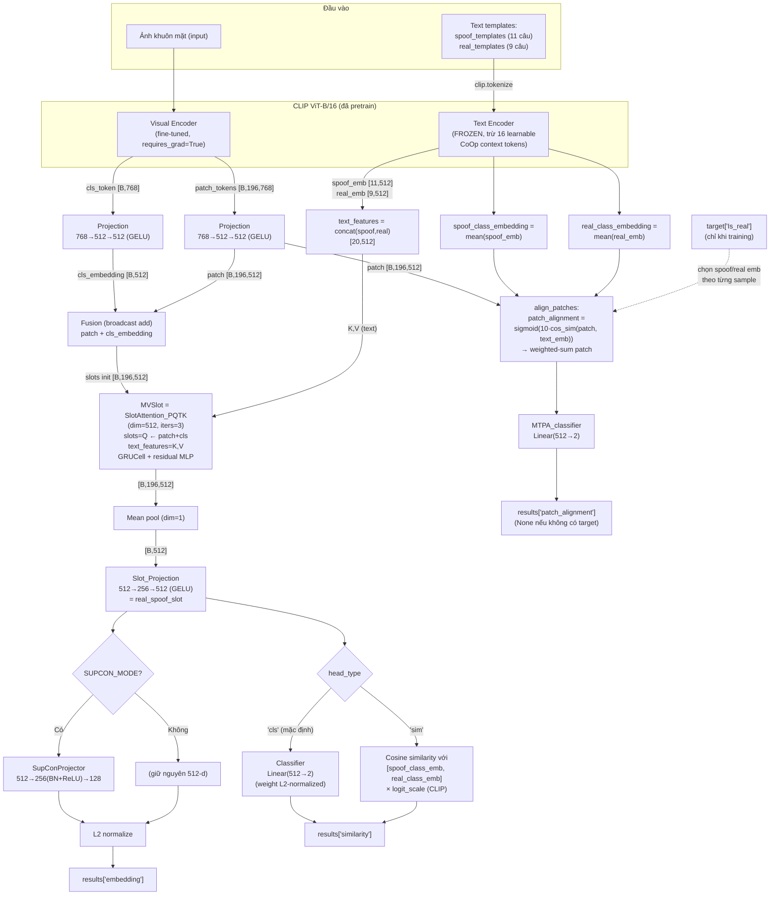
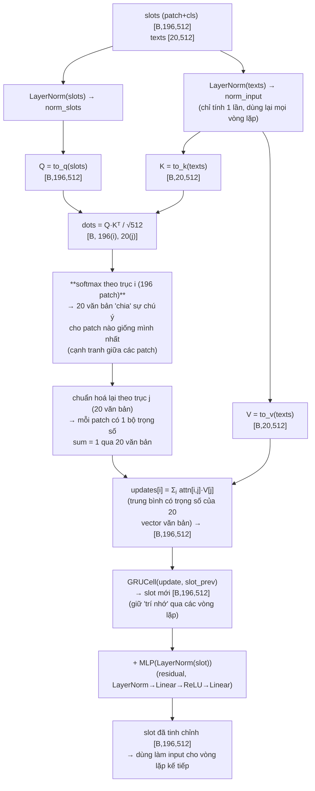
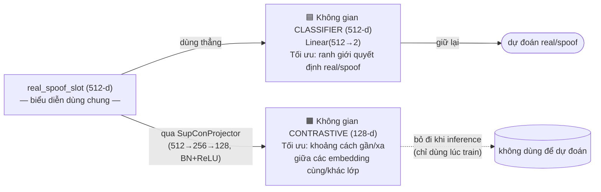

# Báo cáo kiến trúc model — `mspt` (MVP-FAS)

File: [models/MVP_FAS.py](models/MVP_FAS.py)

## 1. Tổng quan

`mspt` (class trong `models/MVP_FAS.py`, được khởi tạo qua `get_network()` trong [models/make_network.py](models/make_network.py)) là model **Face Anti-Spoofing (FAS)** xây dựng trên nền **CLIP (ViT-B/16)**, kết hợp:

- **Prompt-guided Slot Attention** (`MVSlot`) để hợp nhất đặc trưng ảnh (patch + cls token) với đặc trưng văn bản mô tả khuôn mặt thật/giả.
- **Multi-Task Patch Alignment (MTPA)** — nhánh phụ so khớp từng patch ảnh với embedding văn bản real/spoof, dùng làm supervision bổ sung khi có nhãn.
- **SupCon embedding head** (tùy chọn) để huấn luyện contrastive học sâu.

Model nhận vào 1 ảnh khuôn mặt, và (khi train) nhãn `target['Is_real']`; trả về dict `results` gồm `similarity`, `patch_alignment`, `embedding`.

## 2. Sơ đồ khối tổng thể



## 3. Diễn giải luồng dữ liệu

### 3.1. Encoder CLIP (backbone)
- **Visual Encoder** (`self.model.encode_image` → `VisionTransformer.forward_full`, [models/CLIP/model.py:268](models/CLIP/model.py#L268)) trả về 3 giá trị:
  - `cls_embedding` [B,768]: token CLS sau `ln_post` (chưa qua `proj` của CLIP gốc).
  - `_` (bỏ qua): CLS token đã chiếu qua `proj` CLIP gốc (không dùng).
  - `patch` [B,196,768]: 196 patch token (ảnh 224×224, patch 16×16) trước `ln_post`.
- **Text Encoder** (`self.model.encode_text`) mã hoá từng câu template thành vector 512-d (đã qua `text_projection` CLIP gốc).
- Có 2 tập prompt template cố định khai báo ở đầu file: `spoof_templates` (11 câu mô tả tấn công giả mạo) và `real_templates` (9 câu mô tả khuôn mặt thật) — dòng [models/MVP_FAS.py:11-63](models/MVP_FAS.py#L11-L63).

### 3.2. Chiến lược đóng băng tham số (`_freeze_stages`)
Gọi với `exclude_key=['visual', 'learnable']` ([models/MVP_FAS.py:76](models/MVP_FAS.py#L76)):
- Param có tên chứa `"visual"` → **giữ trainable** (toàn bộ Visual Encoder được fine-tune).
- Param có tên chứa `"learnable"` → **giữ trainable**: đây là 16 context-token học được kiểu **CoOp** chèn vào Text Transformer ở [models/CLIP/model.py:200](models/CLIP/model.py#L200) (`self.learnable = nn.Parameter(...)`).
- Mọi param còn lại của CLIP (toàn bộ Text Transformer, token embedding, `ln_final`, `text_projection`, `logit_scale`...) → **đóng băng** (`requires_grad=False`).

→ Nói cách khác: nhánh ảnh được fine-tune toàn bộ, nhánh văn bản gần như đóng băng và chỉ học qua soft-prompt (CoOp).

### 3.3. Projection heads dùng chung kiểu (`Projection`, [models/modules/head.py:49](models/modules/head.py#L49))
- `cls_projection`, `patch_projection`: 2 instance **độc lập** cùng kiến trúc `Linear(768→512) → GELU → Linear(512→512)`, chiếu CLS token và patch token CLIP (768-d) về không gian 512-d dùng chung với module Slot Attention.

### 3.4. MVSlot — Slot Attention có điều kiện văn bản (`SlotAttention_PQTK`, [models/modules/slot_attention_PQTK.py](models/modules/slot_attention_PQTK.py))
Khác với Slot Attention gốc (slots là latent học được), ở đây:
- **Slots khởi tạo** = `patch_embedding + cls_embedding` (broadcast cộng CLS vào từng patch) → mỗi patch đóng vai trò 1 "slot" ban đầu.
- **Key/Value** = `text_features` (toàn bộ 20 embedding câu spoof+real) chiếu qua `to_k`, `to_v`.
- Lặp `iters=3` lần: chuẩn hoá slots → tính `Q=to_q(slots)` → attention `softmax` theo trục slot (không phải trục token) → cập nhật giá trị qua `einsum` → cập nhật slot bằng `GRUCell` → cộng residual MLP (`LayerNorm → Linear → ReLU → Linear`).
- Kết quả: mỗi patch-slot được "kéo" về gần embedding văn bản real/spoof phù hợp nhất, tận dụng không gian ngữ nghĩa CLIP.
- Sau đó **mean-pool** theo chiều patch (dim=1) → 1 vector 512-d đại diện toàn ảnh, rồi qua `Slot_Projection` (`Linear(512→256)→GELU→Linear(256→512)`, thêm `LayerNorm` nếu `head_type='sim'`) → `real_spoof_slot`.

#### 3.4.1. Vì sao gọi patch là "slot"? — so với Slot Attention gốc

Slot Attention nguyên bản (Locatello et al., 2020) dùng **rất ít slot** (vài "vùng chứa" trừu tượng, tự học) để tóm tắt **rất nhiều** input (pixel/patch) — mỗi slot cạnh tranh nhau để "nhận" các input giống mình, qua đó mỗi slot dần đại diện cho 1 object/vùng ảnh.

Trong `MVSlot`, vai trò bị đảo ngược về số lượng nhưng **công thức attention giữ nguyên**:

| | Slot Attention gốc | `MVSlot` (ở đây) |
|---|---|---|
| "Slots" (trục `i`, dùng `to_q`) | vài slot trừu tượng, số lượng ít | **196 patch** (+ cls) — số lượng nhiều |
| "Inputs" (trục `j`, dùng `to_k`,`to_v`) | rất nhiều pixel/patch ảnh | **20 câu văn bản** (11 spoof + 9 real) — số lượng ít |
| Mục tiêu học | slot tóm tắt 1 nhóm pixel → phát hiện "object" | mỗi **patch tự gán nhãn ngữ nghĩa** cho chính nó dựa trên câu văn bản nào mô tả nó giống nhất |

→ Nói cách khác, đây là cơ chế để **mỗi patch ảnh "tự hỏi": trong 20 mô tả real/spoof này, tôi giống mô tả nào nhất?**, rồi cập nhật chính patch đó theo câu trả lời — lặp lại 3 lần để tinh chỉnh dần (comment gốc trong code: `# coarse to fine slot`).

#### 3.4.2. Diễn giải từng bước (1 vòng lặp) kèm shape tensor



**Ý nghĩa 2 bước softmax** (điểm khác biệt tinh tế, dễ bị đọc nhầm):
1. `softmax(dim=1)` — chuẩn hoá theo trục **patch** (không phải trục văn bản!): với 1 câu văn bản cố định, 196 patch phải **cạnh tranh** nhau giành sự chú ý của câu đó → patch càng giống câu văn bản càng "thắng" phần lớn trọng số của câu đó so với các patch khác.
2. Chuẩn hoá lại theo trục **văn bản** (chia cho tổng theo `dim=-1`) — đảm bảo mỗi patch nhận 1 tổ hợp trọng số hợp lệ (tổng = 1) trên 20 văn bản, để bước cập nhật là 1 **trung bình có trọng số** đúng nghĩa (không phải cộng dồn không kiểm soát).

#### 3.4.3. Minh hoạ trực quan trên 1 ảnh khuôn mặt

Ví dụ trực giác (đơn giản hoá) sau 3 vòng lặp, các patch ở từng vùng mặt có xu hướng "gán" mạnh nhất vào câu văn bản mô tả gần với đặc điểm cục bộ của chúng — nhờ tập template có sẵn các mô tả rất cục bộ như *"covered mouth face spoof"*, *"covered eye face spoof"*, *"fake glasses face spoof"*:

```
                     Ảnh khuôn mặt (196 patch, lưới 14×14)
   ┌───────────────────────────────────────────────────────┐
   │   .    .    .    .    .    .    .    .    .    .       │
   │   .    .   [E]  [E]  [E]  [E]   .    .    .    .       │  [E] → gần nhất với
   │   .    .   [E]  [E]  [E]  [E]   .    .    .    .       │      "covered eye / fake
   │   .    .    .    .    .    .    .    .    .    .       │       glasses face spoof"
   │   .    .    .   [N]  [N]   .    .    .    .    .       │  [N] → gần nhất với
   │   .    .    .    .    .    .    .    .    .    .       │      "real face / bonafide face"
   │   .    .   [M]  [M]  [M]  [M]   .    .    .    .       │  [M] → gần nhất với
   │   .    .    .    .    .    .    .    .    .    .       │      "covered mouth face spoof"
   │   .    .    .    .    .    .    .    .    .    .       │  .   → patch nền/da, phân bố
   └───────────────────────────────────────────────────────┘      đều hơn giữa nhiều câu
```

- Vòng lặp 1 (coarse): phần lớn patch còn "mơ hồ", trọng số attention trải khá đều trên nhiều câu văn bản.
- Vòng lặp 2-3 (fine): nhờ `GRUCell` giữ trạng thái + residual MLP tinh chỉnh, các patch dần "chốt" về 1-2 câu văn bản gần nhất — patch nào rơi vào vùng bị che (mắt/miệng) sẽ bị kéo mạnh về phía các template mô tả spoof cục bộ tương ứng; patch da/nền không có dấu hiệu bất thường sẽ ngả về phía các template "real".
- Kết quả cuối (`mean-pool` qua 196 patch) tổng hợp lại thành 1 vector 512-d — nếu nhiều patch "bỏ phiếu" cho spoof, vector tổng sẽ lệch về phía không gian ngữ nghĩa spoof, và ngược lại.

Đây chính là lý do module được đặt tên `MVSlot` (Multi-View/Multi-patch Slot): thay vì chỉ đối chiếu 1 vector CLS toàn ảnh với văn bản (như CLIP zero-shot chuẩn), model đối chiếu **từng patch cục bộ**, giúp bắt được các dấu hiệu giả mạo chỉ xuất hiện ở 1 phần nhỏ khuôn mặt (che mắt, che miệng, viền mặt nạ...).

### 3.5. Ba nhánh đầu ra
1. **`embedding`**: `real_spoof_slot` → (tuỳ chọn) `SupConProjector` (512→256 BN+ReLU→128) nếu `cfg.TRAIN.SUPCON_MODE` bật → L2-normalize. Dùng cho SupCon loss (contrastive), tách biệt khỏi không gian classifier.
2. **`similarity`**: 
   - Nếu `head_type='cls'` (mặc định, code cứng): qua `Classifier` — `Linear(512→2)` có **weight được L2-normalize mỗi forward** (`l2_norm`, [models/modules/head.py:5](models/modules/head.py#L5)).
   - Nếu `head_type='sim'`: tính cosine similarity giữa `real_spoof_slot` (đã chuẩn hoá) và 2 embedding văn bản đại diện (`spoof_class_embedding`, `real_class_embedding`, mỗi cái là mean của các template), nhân `logit_scale` (tham số học được của CLIP, đã exp).
3. **`patch_alignment`** (chỉ tính khi có `target`, tức lúc training/eval có nhãn):
   - `align_patches()`: với từng sample trong batch, chọn embedding văn bản `spoof` hoặc `real` theo nhãn thật `target['Is_real']`.
   - `patch_alignment()`: cosine similarity giữa từng patch (512-d, đã chuẩn hoá) và embedding văn bản đã chọn, nhân 10 rồi qua `sigmoid` → trọng số "độ liên quan" mỗi patch ∈ (0,1), không bắt buộc tổng bằng 1.
   - Nhân trọng số này vào `patch` rồi **sum theo chiều patch** → vector 512-d, qua `MTPA_classifier` (`Linear(512→2)`) → logits phụ trợ giám sát việc patch có "đồng thuận" với nhãn thật/giả không.

## 4. Bảng tóm tắt các module con

| Module | Định nghĩa | Kiến trúc | I/O |
|---|---|---|---|
| `Projection` | [head.py:49](models/modules/head.py#L49) | Linear(768→512)-GELU-Linear(512→512) | 768-d → 512-d |
| `Slot_Projection` | [head.py:11](models/modules/head.py#L11) | Linear(512→256)-GELU-[LayerNorm nếu 'sim']-Linear(256→512) | 512-d → 512-d |
| `Classifier` | [head.py:32](models/modules/head.py#L32) | Linear(512→2), weight L2-norm mỗi forward | 512-d → 2 logits |
| `MTPA_classifier` | dùng lại `Classifier(512)` | như trên | 512-d → 2 logits |
| `SupConProjector` | [head.py:63](models/modules/head.py#L63) | Linear(512→256)-BatchNorm1d-ReLU-Linear(256→128) | 512-d → 128-d |
| `SlotAttention_PQTK` (MVSlot) | [slot_attention_PQTK.py](models/modules/slot_attention_PQTK.py) | Cross-attention slots↔text (3 vòng lặp) + GRUCell + residual MLP | patch+cls [B,196,512], text [T,512] → [B,196,512] |

## 5. Hàm mất mát sử dụng 3 đầu ra (tham khảo [train.py:239-250](train.py#L239-L250))

```
loss = Similarity_alpha  * CrossEntropy(results['similarity'],       Is_real)
     + Patch_align_beta  * CrossEntropy(results['patch_alignment'],  Is_real)
     + supcon_gamma      * SupConLoss(results['embedding'],          Is_real)
```

- `Similarity_alpha`, `Patch_align_beta`, `supcon_gamma` là các trọng số cấu hình trong `cfg.TRAIN` (SupCon chỉ bật khi `cfg.TRAIN.SUPCON_MODE` được set, xem [configs/cfg.py:63](configs/cfg.py#L63)).
- Ba nhánh đầu ra được thiết kế bổ trợ nhau: nhánh classifier học phân loại trực tiếp trên biểu diễn slot đã hợp nhất văn bản; nhánh patch-alignment ép từng patch ảnh phải nhất quán về ngữ nghĩa CLIP với nhãn thật/giả; nhánh SupCon kéo embedding cùng lớp (real/real hoặc spoof/spoof) lại gần nhau trong không gian riêng, không làm nhiễu không gian dùng để phân loại.

## 6. Trực quan hoá: vì sao nhánh SupCon không "nhiễu" không gian classifier

Cả 2 nhánh đều xuất phát từ **cùng một vector gốc** `real_spoof_slot` (512-d), nhưng rẽ thành 2 "không gian đích" khác nhau — SupCon loss chỉ tác động lên không gian phụ, không tác động trực tiếp lên không gian mà classifier dùng để ra quyết định:



Vì `SupConProjector` là một MLP phi tuyến **riêng** (có thêm `BatchNorm`+`ReLU`), nó có đủ "bậc tự do" để tự hấp thụ áp lực kéo/đẩy của SupCon loss mà **không bắt buộc** chính vector 512-d (`real_spoof_slot`) phải biến dạng theo — nếu SupCon tác động thẳng lên không gian 512-d đó (không qua projector riêng), nó sẽ kéo méo luôn ranh giới quyết định mà `Classifier` đang cố học.

Hình dung tác dụng của SupCon loss **bên trong không gian 128-d** đó qua thời gian huấn luyện:

```
   TRƯỚC khi train SupCon                     SAU khi train SupCon
   (embedding rải ngẫu nhiên)                 (cùng lớp bị kéo gần, khác lớp bị đẩy xa)

     R       S                                      R  R
        S      R                                   R  R  R
     S     R                       ─────▶
        R      S                                              S  S
     S                                                        S  S  S
           S       R

   R = embedding ảnh "real"      S = embedding ảnh "spoof"
```

Tóm lại: SupCon loss "dọn dẹp" không gian 128-d này thành các cụm gọn theo lớp (real tách cụm, spoof tách cụm) để hỗ trợ học biểu diễn tổng quát tốt hơn, trong khi không gian 512-d nuôi `Classifier` vẫn được tối ưu độc lập chỉ theo mục tiêu phân loại nhị phân.
